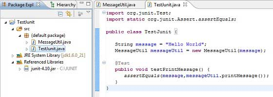
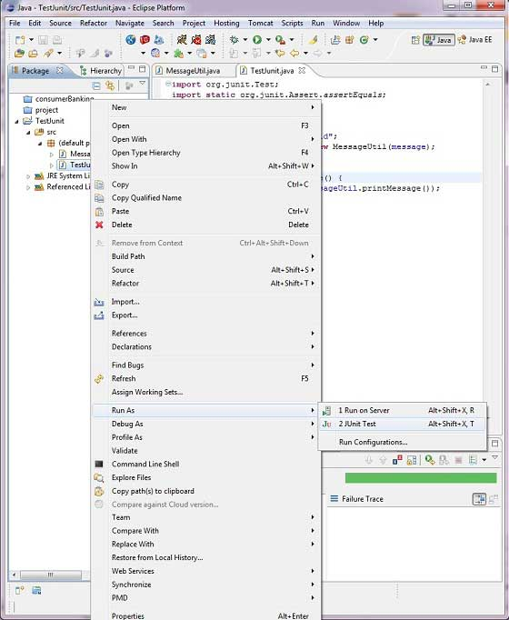

# JUnit - Eclipse 插件  

为了设置带有 eclipse 的 JUnit，需要遵循以下步骤。  

## 步骤 1：下载 Junit archive

下载 **[JUnit](https://github.com/downloads/KentBeck/junit/junit-4.10.jar)**  

|**操作系统**      |**文件名**   |
|:----------|:----------|
|Windows|junit4.10.jar|
|Linux|junit4.10.jar|
|Mac|junit4.10.jar|

假设你在 C:\>JUnit 文件夹中复制了以上 JAR 文件。  

## 步骤 2：设置 Eclipse 环境  

- 打开 eclipse -> 右击 project 并 点击 property > Build Path > Configure Build Path，然后使用 *Add External Jar* 按钮在函数库中添加 junit-4.10.jar。


- 我们假设你的 eclipse 已经内置了 junit 插件并且它在 C:\>eclipse/plugins 目录下，如不能获得，那么你可以从 [JUnit Plugin](http://sourceforge.net/projects/e-junitdoclet/files/latest/download) 上下载。在 eclipse 的插件文件夹中解压下载的 zip 文件。最后重启 eclipse。  

**现在你的 eclipse 已经准备好 JUnit 测试用例的开发了。**  

## 步骤 3：核实 Eclipse 中的 Junit 安装

- 在 eclipse 的任何位置上创建一个 TestJunit 项目。
- 创建一个 MessageUtil 类来在项目中测试。

```
/*
* This class prints the given message on console.
*/
public class MessageUtil {

   private String message;

   //Constructor
   //@param message to be printed
   public MessageUtil(String message){
      this.message = message;
   }
      
   // prints the message
   public String printMessage(){
      System.out.println(message);
      return message;
   }   
} 
```

- 在项目中创建一个 test 类 TestJunit

```
import org.junit.Test;
import static org.junit.Assert.assertEquals;

public class TestJunit {
	
   String message = "Hello World";	
   MessageUtil messageUtil = new MessageUtil(message);

   @Test
   public void testPrintMessage() {	  
      assertEquals(message,messageUtil.printMessage());
   }
}
```

下面是项目结构



最后，通过右击程序和 run as junit 验证程序的输出。



验证结果


